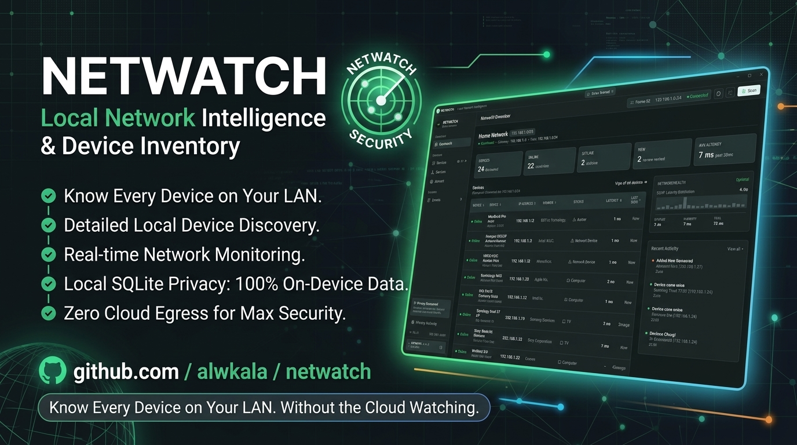
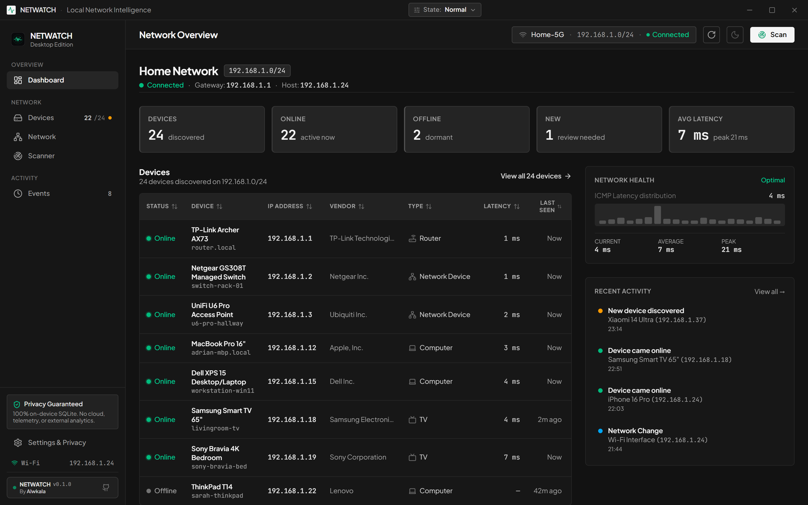
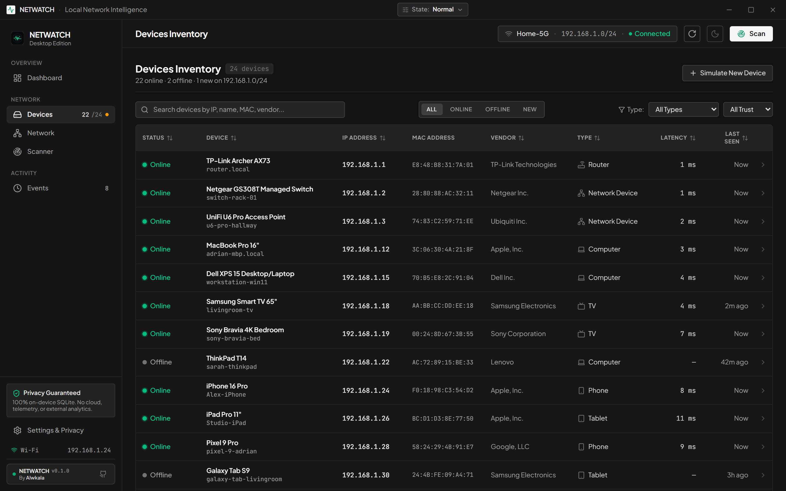
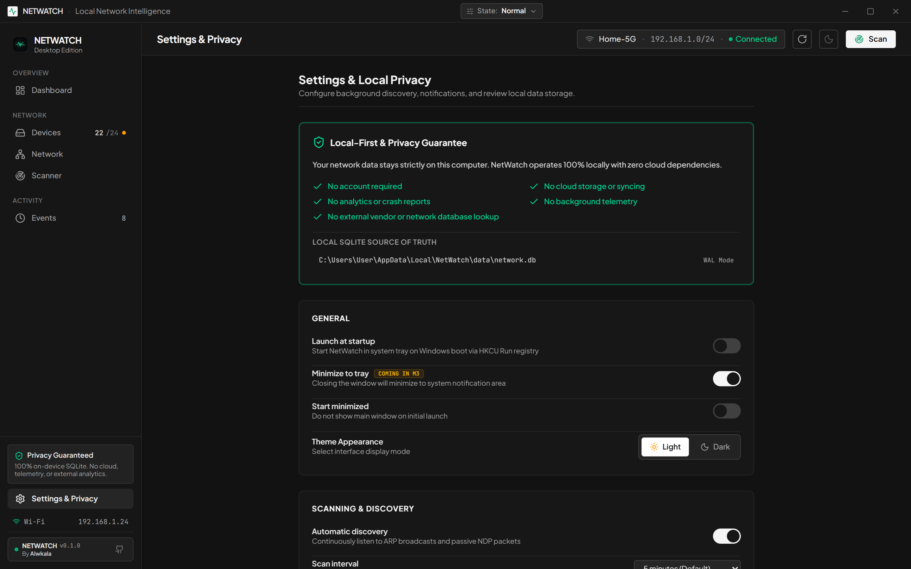
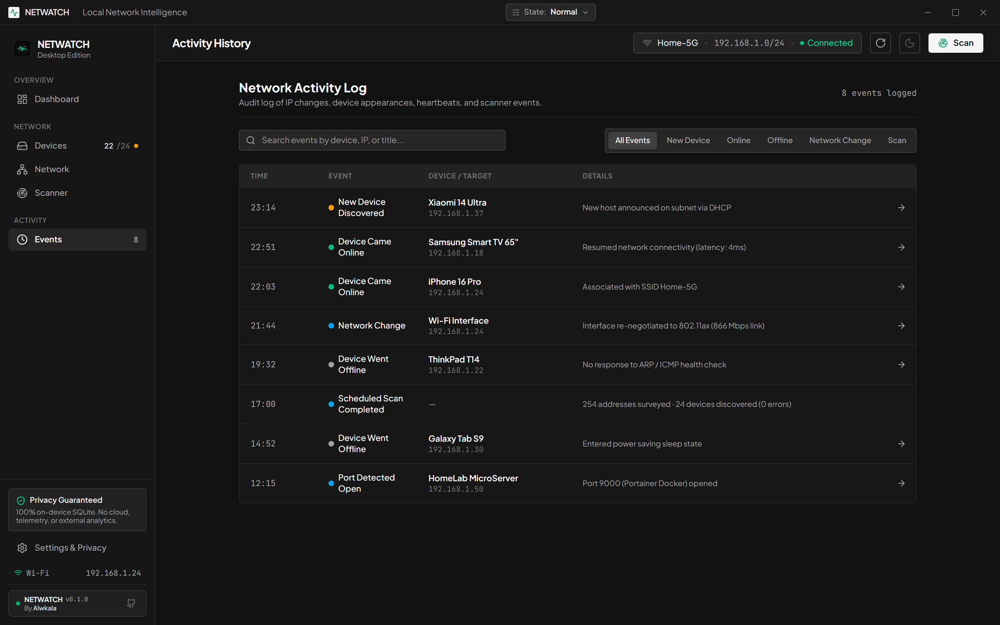

# NETWATCH

<div align="center">

### تعرّف على كل جهاز في شبكتك المحلية.. دون أن تراقبك السحابة.

**تطبيق مكتبي ذكي لإدارة أصول الشبكة المحلية واكتشاف الأجهزة بخصوصية مطلقة (Local-First) لأنظمة Windows و Linux و macOS.**

<p align="center">
  <a href="README.md"><b>English</b></a> •
  <b>العربية</b>
</p>

[](https://github.com/alwkala/NETWATCH/releases)
[](https://github.com/alwkala/NETWATCH/actions/workflows/ci.yml)
[](LICENSE-MIT)
[](#ضمان-الخصوصية-المطلقة)
[](#التشغيل-السريع)

<br>



<br><br>

<p align="center">
  <a href="https://github.com/alwkala/NETWATCH/releases"><b>⬇️ تحميل لنظام Windows (.exe)</b></a> •
  <a href="#معاينة-الواجهة"><b>📸 جولة مصورة</b></a> •
  <a href="#كيف-يعمل-netwatch"><b>⚡ كيف يعمل؟</b></a> •
  <a href="docs/ARCHITECTURE.md"><b>🛠️ البنية المعمارية</b></a> •
  <a href="https://github.com/alwkala/NETWATCH/wiki"><b>🌐 الويكي التوثيقي</b></a>
</p>

</div>

---

## لماذا صُمم NETWATCH؟

> *"المسح المؤقت يخبرك بما هو متصل الآن فقط..  
> أما سجل الأصول فيخبرك بما تغيّر عبر الزمن."*

عند اتصالك بشبكة Wi-Fi في المنزل أو المكتب أو موقع عمل العميل، فإنك تحتاج دائماً لإجابات مباشرة عن أسئلة حاسمة:
- *ما هي الأجهزة المتصلة بالشبكة في هذه اللحظة؟*
- *ما هو هذا العنوان الغامض (IP) الذي ظهر فجأة على الشبكة الفرعية؟*
- *من انضم إلى الشبكة اليوم؟ وهل تمت إعادة تشغيل الخادم المنزلي؟*
- *هل حصل هاتفي أو حاسوبي على عنوان IP جديد؟*

الأدوات التقليدية القديمة (مثل *Advanced IP Scanner* أو *Angry IP Scanner*) هي أدوات فحص لحظية مؤقتة: تقوم بمسح عابر وتعرض جدولاً بسيطاً، ثم **تتخلص من كافة البيانات في اللحظة التي تغلق فيها البرنامج**.

**NETWATCH يقدم مفهوماً مختلفاً تماماً:**  
عملية المسح هنا ليست سوى مستشعر لاستقبال البيانات. في الخلفية، يحتفظ NETWATCH بـ **سجل أصول دائم ومحلي داخل قاعدة بيانات SQLite**. يتذكر التطبيق كل جهاز اتصل بالشبكة، ويتتبع عمليات الانضمام والمغادرة وتغير العناوين، ويتيح لك تنظيم أجهزتك في مخزون واضح وقابل للبحث والتصنيف — **100% بدون اتصال خارجي، وبدون سحابة، وبدون أي تتبع أو إرسال بيانات (Zero Egress).**

---

## القدرات والمميزات الأساسية

### ⚡ 1. استكشاف فوري للشبكة الفرعية (بدون صلاحيات مسؤول)
يكتشف جميع الحواسيب والهواتف والطابعات والتلفزيونات الذكية ومستشعرات إنترنت الأشياء (IoT) النشطة على شبكتك الفرعية (`/24`) خلال ثوانٍ معدودة.  
يعتمد NETWATCH على واجهات برمجة نظام التشغيل القياسية دون الحاجة لصلاحيات مدير النظام (No Admin / No UAC)، وبدون الحاجة لتعريفات التقاط حزم خارجية مثل WinPcap أو Npcap.

### 🏷️ 2. بصمة عتادية معزولة محلياً (Air-Gapped)
يتعرف فورياً على الشركات المصنعة للأجهزة (Apple, Intel, Samsung, Espressif, Raspberry Pi, ZTE, إلخ) اعتماداً على **قاعدة بيانات IEEE OUI مدمجة بالكامل دون اتصال بالإنترنت**. لا يتم إرسال عناوين MAC لأي خدمات أو خوادم خارجية إطلاقاً.

### 🎨 3. تخصيص هوية الأجهزة وأيقوناتها
يمكنك تسمية أجهزتك بأسماء مخصصة ومألوفة (مثال: *"Apple TV غرفة المعيشة"*، *"خادم Proxmox الرئيسي"*، *"طابعة المكتب"*). يمكنك اختيار فئات الأجهزة وأيقوناتها المخصصة (`حاسوب`، `هاتف`، `خادم`، `راوتر`، `IoT`، `كاميرا`، `طابعة`، `منصة ألعاب`). تُحفظ هذه الإعدادات بشكل دائم في قاعدة البيانات ولا تتأثر بعمليات إعادة الفحص اللاحقة.

### 🛡️ 4. كشف عناوين MAC العشوائية ودمج الأجهزة (Private MAC)
تقوم الهواتف الذكية الحديثة (iOS و Android) وأنظمة Windows بتدوير وتغيير عناوين MAC لحماية الخصوصية. يكتشف NETWATCH عناوين الماك الخاصة والعشوائية تلقائياً ويوفر **أداة دمج بضغطة زر (Device Merge)** لتوحيد سجلات الجهاز المتفرقة تحت سجل واحد متكامل.

### 🤝 5. تصنيف مستويات الثقة الثلاثية
نظّم أجهزة شبكتك وفق مستويات أمان محددة:
- **`معروف (Known)`**: أصول معتمدة وموثوقة (أجهزتك الشخصية، هواتف العائلة، خوادمك).
- **`ضيف (Guest)`**: زوار مؤقتون في الشبكة.
- **`غير معروف (Unknown)`**: أجهزة جديدة أو غير معروفة تحتاج للفحص والتحقق.

### 🌐 6. اكتشاف بروتوكولات متعددة متقدمة (IPv6 و WSD)
- **بروتوكول IPv6 NDP**: قراءة واستيعاب عناوين IPv6 للأجهزة المجاورة بدون صلاحيات مرتفعة.
- **بروتوكول WS-Discovery (`UDP:3702`)**: اكتشاف أجهزة Windows والطابعات وكاميرات ONVIF التي تتجاهل فحص mDNS التقليدي، مع معالجة آمنة لرسائل XML تمنع ثغرات XXE.
- **mDNS و SSDP و NetBIOS**: استخلاص أسماء الأجهزة والخدمات المعلنة محلياً.

### 🚀 7. إجراءات سريعة للأجهزة (Open Device Actions)
لوحة تحكم سريعة داخل صفحة تفاصيل الجهاز تمكّنك من:
- فتح واجهة الويب (`HTTP :80` أو `HTTPS :443`) مباشرة في متصفحك الافتراضي بأمان عبر خادم محلي معزول يمنع تسريب البيانات الخارجية.
- نسخ أوامر الاتصال الطرفي بضغطة زر (`SSH` و `RDP Desktop`).
- اختبار الاتصال اللحظي بـ `Ping` وإرسال حزم الإيقاظ عبر الشبكة `Wake-on-LAN`.

### 🌍 8. واجهة عربية كاملة وتصميم أصيل من اليمين لليسار (RTL)
- ترجمة عربية كاملة لجميع شاشات وإشعارات التطبيق مع إمكانية التبديل اللحظي بين العربية والإنجليزية.
- دعم محاذاة وتخطيط كامل من اليمين لليسار (`dir="rtl"`) مع خطوط مدمجة محلياً عالية الجودة (*Cairo* و *Alexandria*).
- عزل دقيق وثنائي الاتجاه للمعرفات التقنية وعناوين IP و MAC لمنع تشوه الأرقام والرموز.

---

## لمن صُمم NETWATCH؟

| الفئة المستهدفة | كيف يفيدك NETWATCH؟ |
|---|---|
| 🏠 **أصحاب المعامل المنزلية والـ Self-Hosters** | تتبع أجهزة Raspberry Pi وخوادم التخزين (NAS) ومجموعات Proxmox ومستشعرات المنزل الذكي دون الحاجة لتثبيت برمجيات عميلة ثقيلة. |
| 💻 **مهندسو الشبكات والعمل عن بُعد** | تدقيق شبكات العملاء وشبكات المنازل فورياً، والتحقق من توزيعات الـ IP، واختبار زمن استجابة البوابة الافتراضية، وفحص المنافذ المفتوحة. |
| 🛡️ **المدافعون عن الخصوصية والأمن** | فحص ومراقبة كل جهاز في منزلك دون الوثوق بماسات سحابية أو إرسال خريطة شبكتك لخوادم خارجية. |
| 🏢 **مسؤولو تكنولوجيا المعلومات في المكاتب الصغيرة** | معرفة الأجهزة الدخيلة فور توصيلها بمقسم الشبكة، وكشف تعارض العناوين، والاحتفاظ بسجل أصول دائم. |

---

## معاينة الواجهة

<table width="100%">
  <tr>
    <td width="50%" valign="top">
      <h4 align="center">سجل الأصول اللحظي (Device Ledger)</h4>
      
      <p align="center"><em>قائمة قابلة للبحث لجميع أجهزة الشبكة مع مؤشرات الاستجابة والشركات المصنعة وحالة الاتصال.</em></p>
    </td>
    <td width="50%" valign="top">
      <h4 align="center">هيكلية الشبكة والتسلسل الهرمي (Topology)</h4>
      
      <p align="center"><em>رسم بياني مرئي للهيكل الفيزيائي والمنطقي للشبكة موضحاً البوابة، الراوتر، والأجهزة المتصلة.</em></p>
    </td>
  </tr>
  <tr>
    <td width="50%" valign="top">
      <h4 align="center">ملف وتفاصيل الجهاز (Device Dossier)</h4>
      
      <p align="center"><em>تخصيص الأسماء والأيقونات، وفحص أدلة البروتوكولات، والوصول للإجراءات السريعة.</em></p>
    </td>
    <td width="50%" valign="top">
      <h4 align="center">سجل الأحداث والتدقيق (Activity Timeline)</h4>
      
      <p align="center"><em>خط زمني يسجل تاريخ انضمام ومغادرة الأجهزة وتغير عناوين IP بدقة متناهية.</em></p>
    </td>
  </tr>
</table>

---

## التشغيل السريع

### نظام Windows (موصى به)
1. حمّل ملف **`netwatch.exe`** من [صفحة أحدث الإصدارات](https://github.com/alwkala/NETWATCH/releases).
2. *(اختياري وموصى به)* تحقق من البصمة الرقمية للبرنامج عبر SHA-256:
   ```powershell
   Get-FileHash .\netwatch.exe -Algorithm SHA256
   ```
3. شغّل البرنامج بالنقر المزدوج:
   - **لا يتطلب تثبيتاً** (ملف تنفيذي مستقل ومحمول Portable).
   - **لا يتطلب صلاحيات مسؤول** (يعمل في وضع المستخدم العادي Unprivileged).
   - تُحفظ جميع بياناتك محلياً في المسار: `%LOCALAPPDATA%\NetWatch\data\network.db`.

### نظام Linux وخوادم المراقبة (Headless)
للعمل على الخوادم وأنظمة Linux دون واجهة رسومية:
```bash
# استنساخ المستودع
git clone https://github.com/alwkala/NETWATCH.git && cd NETWATCH

# تشغيل الخدمة الخلفية المستقلة
go run ./cmd/netwatchd
```

---

## ضمان الخصوصية المطلقة

بُني NETWATCH على مبدأ معماري غير قابل للمساومة: **"بيانات شبكتك ملكٌ لك وحدك."**

- **عدم رفع أي بيانات للسحابة**: عناوين IP والماك وخريطة الشبكة لا تغادر جهازك أبداً.
- **صفر تتبع وقياس عن بُعد (Zero Telemetry)**: لا توجد إحصائيات، لا منارات تتبع، ولا حسابات مستخدمين.
- **تخزين محلي كامل عبر SQLite**: كافة السجلات والإعدادات محفوظة في ملف SQLite مفتوح ومحلي على قرصك الصلب.
- **خطوط وطباعة معزولة**: جميع الخطوط (*Cairo*, *Alexandria*, *Plus Jakarta Sans*, *JetBrains Mono*) مدمجة بالكامل داخل التطبيق دون أي طلبات لـ Google Fonts أو CDNs خارجية.
- **بوابة فحص أمني آلية في الـ CI**: فحص برمجي آلي مع كل Commit للتأكد من استحالة وجود أي اتصالات خروج غير مصرح بها.

---

## الترخيص (License)

مشروع NETWATCH مرخص بترخيص مزدوج تحت كل من **[ترخيص MIT](LICENSE-MIT)** و **[ترخيص Apache 2.0](LICENSE-APACHE)**.  
لك حرية الاختيار والعمل بأي منهما.
